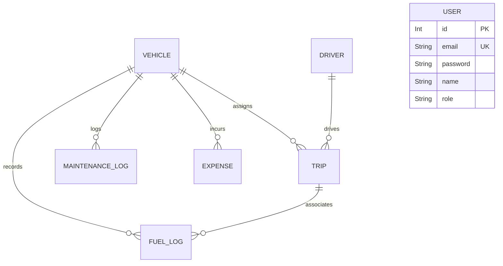

# TransitOps Database Schema Specification

This document details the relational data model for the TransitOps fleet management console. The database uses **MySQL** as its persistent storage engine, managed via **Prisma ORM**.

---

## 1. Entity Relationship Overview

The database tracks vehicles, drivers, trips, maintenance logs, operational fuel purchases, and miscellaneous expenses.

---

## 2. Table Specifications

### 2.1 `User`
Stores credential records and authorization roles for platform members.
- **Constraints**: Email is case-insensitive, unique, and trimmed.

| Field Name | Data Type | Key / Index | Nullable | Description |
| :--- | :--- | :--- | :--- | :--- |
| `id` | `Int` | `PK`, Auto-increment | No | Primary Identifier |
| `email` | `String` | `Unique` | No | Account login email address |
| `password` | `String` | — | No | bcrypt hashed password string (10 rounds) |
| `name` | `String` | — | No | Profile display name |
| `role` | `String` | — | No | Role: `FleetManager`, `Driver`, `SafetyOfficer`, `FinancialAnalyst` |

---

### 2.2 `Vehicle`
Stores the registry of all fleet physical assets.

| Field Name | Data Type | Key / Index | Nullable | Description |
| :--- | :--- | :--- | :--- | :--- |
| `id` | `Int` | `PK`, Auto-increment | No | Primary Identifier |
| `reg_no` | `String` | `Unique` | No | License plate registration number |
| `name` | `String` | — | No | Vehicle make/model name |
| `type` | `String` | — | No | Classification: `Van`, `Truck`, `Sedan` |
| `max_load_kg`| `Float` | — | No | Maximum load carry capacity |
| `odometer_km`| `Float` | — | No | Current total mileage odometer |
| `acquisition_cost`| `Float` | — | No | Cost at purchase time (for ROI formulas) |
| `status` | `String` | — | No | Status: `Available`, `On Trip`, `In Shop`, `Retired` |
| `region` | `String` | — | No | Operating region: `North`, `South`, `East`, `West` |

---

### 2.3 `Driver`
Stores driver profile metrics and status.

| Field Name | Data Type | Key / Index | Nullable | Description |
| :--- | :--- | :--- | :--- | :--- |
| `id` | `Int` | `PK`, Auto-increment | No | Primary Identifier |
| `name` | `String` | — | No | Full legal name |
| `license_no` | `String` | `Unique` | No | Driver license identifier |
| `license_category`| `String`| — | No | Category, e.g., `Heavy Truck (Class A)` |
| `license_expiry`| `DateTime`| — | No | Expiration timestamp |
| `contact_number`| `String` | — | No | Phone number |
| `safety_score`| `Float` | — | No | Running rating score: `1.0` to `5.0` |
| `status` | `String` | — | No | Status: `Available`, `On Trip`, `Off Duty`, `Suspended` |

---

### 2.4 `Trip`
Logs dispatch runs, revenues, and final trip telemetry.

| Field Name | Data Type | Key / Index | Nullable | Description |
| :--- | :--- | :--- | :--- | :--- |
| `id` | `Int` | `PK`, Auto-increment | No | Primary Identifier |
| `source` | `String` | — | No | Origin location address |
| `destination`| `String` | — | No | Destination location address |
| `vehicle_id` | `Int` | `FK` (Vehicle) | No | Assigned vehicle reference |
| `driver_id` | `Int` | `FK` (Driver) | No | Assigned driver reference |
| `cargo_weight_kg`| `Float` | — | No | Payload cargo weight |
| `planned_distance_km`| `Float`| — | No | Target distance in kilometers |
| `revenue` | `Float` | — | No | Generated revenue from invoice |
| `status` | `String` | — | No | Status: `Draft`, `Dispatched`, `Completed`, `Cancelled` |
| `final_odometer_km`| `Float` | — | Yes | Ending odometer reading logged on completion |
| `fuel_consumed_l`| `Float` | — | Yes | Total fuel burned on this run |
| `created_at` | `DateTime`| — | No | Row creation timestamp |
| `updated_at` | `DateTime`| — | No | Row last update timestamp |

---

### 2.5 `MaintenanceLog`
Stores service records and vehicle shop history.

| Field Name | Data Type | Key / Index | Nullable | Description |
| :--- | :--- | :--- | :--- | :--- |
| `id` | `Int` | `PK`, Auto-increment | No | Primary Identifier |
| `vehicle_id` | `Int` | `FK` (Vehicle) | No | Target vehicle asset reference |
| `type` | `String` | — | No | Classification: `Routine`, `Brakes`, `Engine`, `Electrical` |
| `cost` | `Float` | — | No | Cost of servicing and parts |
| `opened_date`| `DateTime`| — | No | Shop check-in timestamp |
| `closed_date`| `DateTime`| — | Yes | Shop release timestamp |
| `status` | `String` | — | No | Status: `Active`, `Closed` |
| `notes` | `String` | — | Yes | Service notes |

---

### 2.6 `FuelLog`
Stores fuel logs for calculating vehicle efficiency.

| Field Name | Data Type | Key / Index | Nullable | Description |
| :--- | :--- | :--- | :--- | :--- |
| `id` | `Int` | `PK`, Auto-increment | No | Primary Identifier |
| `vehicle_id` | `Int` | `FK` (Vehicle) | No | Vehicle reference |
| `trip_id` | `Int` | `FK` (Trip) | Yes | Optional trip reference |
| `liters` | `Float` | — | No | Liters of fuel purchased |
| `cost` | `Float` | — | No | Cost of fuel run |
| `date` | `DateTime`| — | No | Log date |

---

### 2.7 `Expense`
Stores miscellaneous operation costs (Tolls, Insurance, Permits).

| Field Name | Data Type | Key / Index | Nullable | Description |
| :--- | :--- | :--- | :--- | :--- |
| `id` | `Int` | `PK`, Auto-increment | No | Primary Identifier |
| `vehicle_id` | `Int` | `FK` (Vehicle) | No | Vehicle reference |
| `category` | `String` | — | No | Class: `Toll`, `Insurance`, `Permit`, `Other` |
| `amount` | `Float` | — | No | Transaction cost |
| `date` | `DateTime`| — | No | Transaction timestamp |
| `notes` | `String` | — | Yes | Additional description notes |
